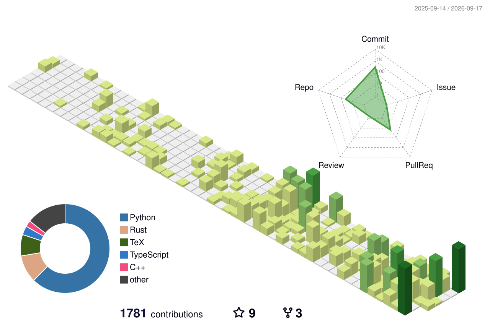

# Hey, I'm Arth 👋

**AI Safety & Red-Teaming researcher** · Mumbai, India 🇮🇳

I'm a Research Engineer in the AI Safety department at **AIM Intelligence**, and I collaborate with **Jinesis Lab** under Zhijing Jin at the University of Toronto and the Vector Institute. Previously, I was a Research Collaborator with **FAR.AI**, where I helped build their Red-Teaming Toolkit.

Outside of research: chatting, coffee, photography, and giving people surprises.

### Selected work

- [arth-whitebox-redteam](https://github.com/Arth-Singh/arth-whitebox-redteam) — open-source framework for mechanistic-interpretability-driven red teaming of LM safety mechanisms
- [moral-reasoning-ICML](https://github.com/Arth-Singh/moral-reasoning-ICML) — moral-reward reinforcement learning in iterated social-dilemma games
- [arth-finds-weird-model-behaviours](https://github.com/Arth-Singh/arth-finds-weird-model-behaviours) — a running log of strange LLM behaviours I find in the wild
- [JEF-Chrome-Extension](https://github.com/Arth-Singh/JEF-Chrome-Extension) — browser extension for scoring jailbreaks with the JEF framework without tab-switching

<picture>
  <source media="(prefers-color-scheme: dark)" srcset="profile-3d-contrib/profile-night-green.svg">
  <source media="(prefers-color-scheme: light)" srcset="profile-3d-contrib/profile-green-animate.svg">
  
</picture>
